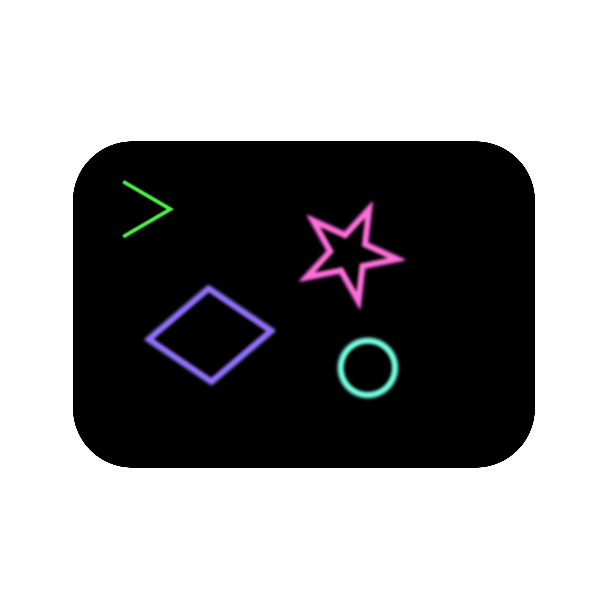

 

# TwUI
## Extended Ratatui Widgets

## Included Widgets
| Name                                                                              | Description                                          | Image |
| --------------------------------------------------------------------------------- | ---------------------------------------------------- | ----- |
| [`Button`](https://docs.rs/tuwi/0.1.0/tuwi/widgets/struct.Button.html)            | A simple button                                      | ..    |
| [`Input`]((https://docs.rs/tuwi/0.1.0/tuwi/widgets/struct.Input.html))            | A text input field                                   | ..    |
| [`Secret`]((https://docs.rs/tuwi/0.1.0/tuwi/widgets/struct.Secret.html))          | A password-like input field                          | ..    |
| [`Numeric Input`]((https://docs.rs/tuwi/0.1.0/tuwi/widgets/struct.NumInput.html)) | A number input field                                 | ..    |
| [`List`]((https://docs.rs/tuwi/0.1.0/tuwi/widgets/struct.List.html))              | List with the ability to add / remove items          | ..    |
| [`Slider`]((https://docs.rs/tuwi/0.1.0/tuwi/widgets/struct.Slider.html))          | A numerical slider                                   | ..    |
| [`Scroll`]((https://docs.rs/tuwi/0.1.0/tuwi/widgets/struct.Scroll.html))          | A container that allows overflow scrolling           | ..    |
| [`Form`]((https://docs.rs/tuwi/0.1.0/tuwi/widgets/struct.Form.html))              | A form that takes multiple inputs and handles state* | ..    |
| [`Popup`]((https://docs.rs/tuwi/0.1.0/tuwi/widgets/struct.Popup.html))            | A popup that can nest a form                         | ..    |
| [`Titled`]((https://docs.rs/tuwi/0.1.0/tuwi/widgets/struct.Titled.html))          | A container with a title                             | ..    |
